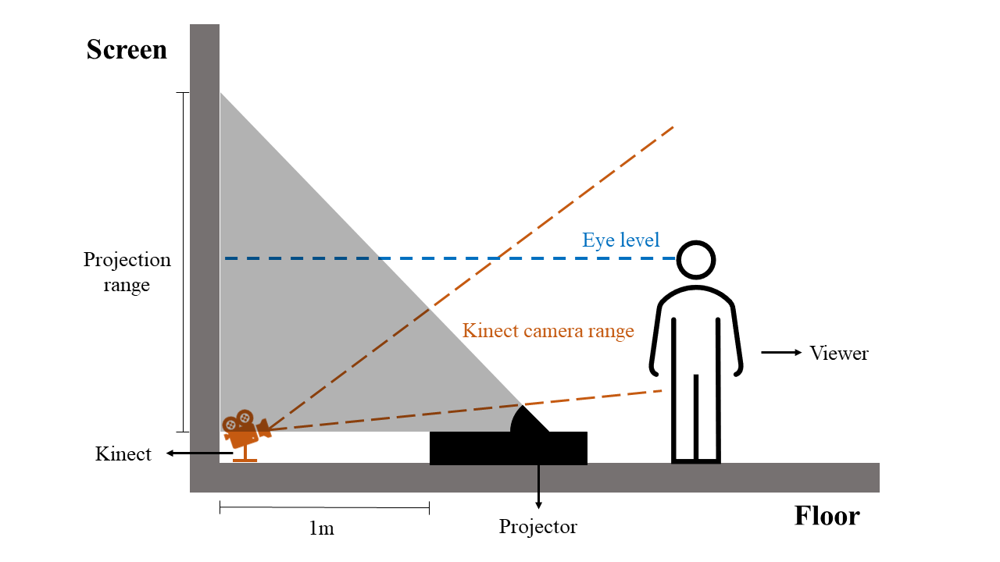

# Cometale
<b>Cometale</b> is an interactive installation that creates a unique and engaging experience that highlights the interconnectedness of history and nature by combining ancient and modern elements. By developing this installation, I hope to offer visitors a chance to reflect on the historical events, and how they continue to shape our understanding of the world around us today. 
This repository contains media sources and codes of Cometale project. To view the .toe files, you may open it with the [TouchDesigner](https://derivative.ca/download) software installed on your computer.   

You may find more about Cometale from my online portfolio: https://www.fuguosmediaspace.me/work/cometale. 

<!-- Instruction for Installation -->
## Instruction for Installation
To install the Cometale as an interactive projection, you need a laptop or desktop, a Kinect, the TouchDesigner program in this repository, a speaker, a short-throw projector, and a projection screen. To achieve the optimal viewing experience, you may consider set up this projection in a dark or dimmed room of at least 6m x 5m in size. 

  

### Step 1: Get the TouchDesigner program running with Kinect
First, please have the latest version of [TouchDesigner](https://derivative.ca/download) installed on your computer. Then, connect your Kinect to your computer. Next, double-click on the TochDesigner file to open it. The background music should be automatically playing in a loop. In the TouchDesigner interface, you shall see a node called "kinect1". Please select the Kinect version in the "Hardware version" parameter of the node according to the Kinect you use. Then, if there are people in the Kinect camera range, you shall see their silhouette in white color in the node "comp1". 
### Step 2: Set up the interactive projection
After completing step 1, put Kinect against the bottom center of the screen. Then, place the short-throw projector 1 meter away from the screen without blocking the Kinect's line of sight. Connect the projector to your computer and adjust the position of the projector and Kinect to ensure that every part of the projector animates correctly when someone is standing in front of the projector. Finally, connect the speakers to your computer. 
<!-- Instruction for Interactions -->
## Instruction for Interactions
To interact with the projection, you may stand in front of it and watch it animate to reveal a synthetic comet generated by AI. There are more ways to interact with it, which you can find from the Cometale introductory video: https://vimeo.com/xuefuguo/cometale. You can also explore further to create your own ways of interaction. 
